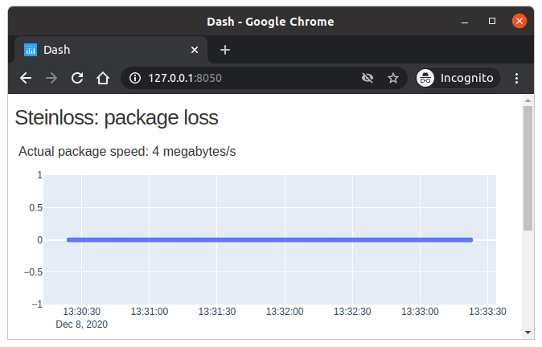
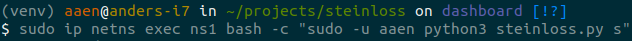
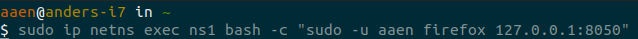

[](https://wakatime.com/badge/github/steinwurf/steinloss)

[](https://badge.fury.io/py/steinloss)

# Steinloss:
This is a tool for measuring packages loss, between two endpoint, with a web visualizer.

## Usage
On the server end, run:
- `pip install steinloss`
- `python -m steinloss --server`

On the probe end, run:
- `pip install steinloss`
- `python -m steinloss --probe --ip-address $IP_OF_SERVER`


The server end will host a gui on port 8050, where the stats are visible. It looks like this:



## Build and release
To make a new release, go to github release, and draft a new release. A github action will take care of building, and publishing the tar and binary to pypi.

### Demo with artificial packet loss
|The demo is made for linux|
| --- |
First we install steinloss

```
pip3 install steinloss
```

To run a demo of the tool, we're setting up a virtual network on your machine using ip nets.
We're making a network `n1` and `n2` by running
```
sudo sh demo.sh
```

Now we would like to run the server on `n1` and the probe on `n2`
This is done with the following commands in two different terminals:

```bash
sudo ip netns exec ns1 bash -c "sudo -u $USER python3 -m steinloss -s"
```

```bash
sudo ip netns exec ns2 bash -c "sudo -u $USER python3 -m steinloss -p -i 10.0.0.1"
```
For example:



To access the browser, we to run a browser in our virtual network like so
```bash
sudo ip netns exec ns1 bash -c "sudo -u $USER $BROWSER 127.0.0.1:8050"
```
Like so:



Now we can modify the packet loss by using the replace command. To set the packet loss to 20%, we run the following command, while everything is running:
```bash
sudo ip netns exec ns1 tc qdisc replace dev h1 root netem loss 20%
```
#### Cleanup
The virtual networks can be removed again with:
```bash
sudo ip netns delete ns1 && sudo ip netns delete ns2
```

And uninstall steinloss:
```
pip3 uninstall steinloss
```
